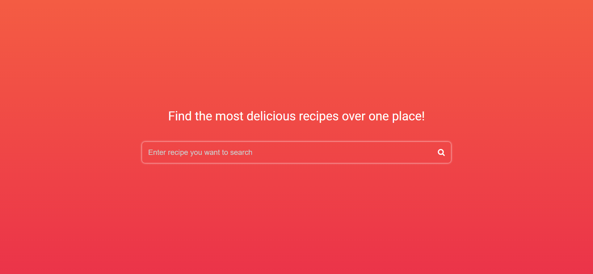
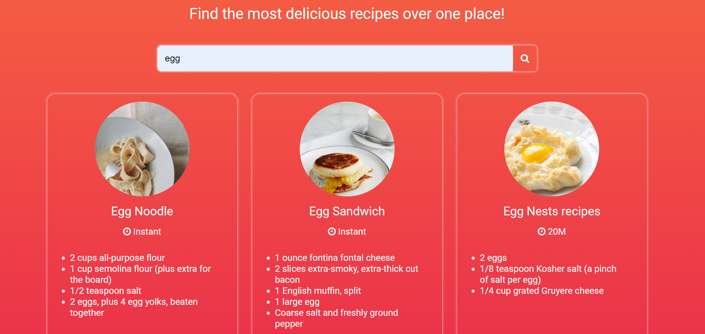
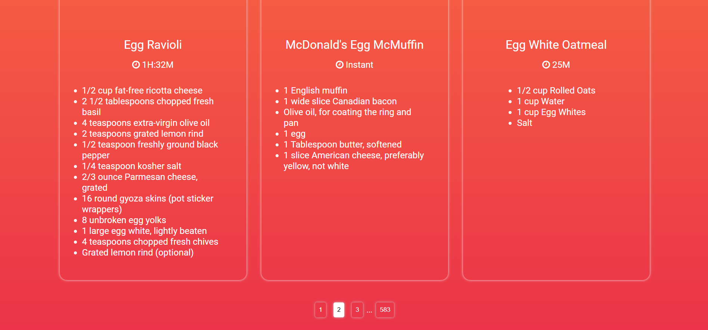

# RecipeSearch: A Recipe Search App Made Using React.js

A Simple Recipe App made using React.js. 

## API Used

https://developer.edamam.com/edamam-docs-recipe-api

## Content Covered

API Integration 
Custom Pagination 
Responsive UI

## Must Read

The API response claims to have result count(No. of recipes) for each search value to be a very large number while actually the documents are not more than 100. 
That is the reason why you might not see anything after page number 9. 

Detailed Explaination: 
ItemsPerPage = 12 
Page = 9 
Therefore 12 * 9  = 108 i.e. > 100 
Thus the 9th page might only be showing values 96 - 100 and nothing after that. 

Also, 
You need to add your own: 
1) FontAwesome CDN in index.html
2) APP_ID in App.js
3) APP_KEY in App.js

## To run this app..

### Run 'cd your-app-root-directory'

Navigate to the root folder where you copied the code.

### Run 'npm install'

Installs all the dependencies.

### Run 'npm start'

Runs the app in the development mode.\
Open [http://localhost:3000](http://localhost:3000) to view it in the browser.

## A few Screen Shots...

### Initial Look

    

### Searched Results

    

### Pagination

    

